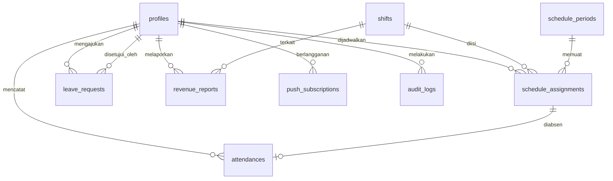

# Skema Database

Postgres (Supabase). Semua timestamp `timestamptz` disimpan UTC; tampilan dikonversi ke WIB.
Semua id `uuid` dengan default `gen_random_uuid()` kecuali disebutkan lain.

## Diagram relasi



## Tabel

### profiles
Perpanjangan `auth.users`. Satu baris per pengguna.

Baris dibuat otomatis oleh trigger `on_auth_user_created` saat pendaftaran mandiri, dengan
`role = 'host'` dan `account_status = 'pending'`. Akun yang dibuat admin lewat route handler
langsung disetel `account_status = 'active'`.

| Kolom | Tipe | Catatan |
|---|---|---|
| id | uuid PK | = `auth.users.id` |
| role | text | `admin` \| `host` |
| full_name | text | wajib |
| avatar_url | text | foto profil, di Storage |
| phone | text | nomor HP aktif / kontak darurat |
| email | text | dicermin dari auth untuk kemudahan query |
| address | text | alamat domisili |
| birth_date | date | |
| join_date | date | tanggal mulai kerja |
| employment_status | text | `active` \| `inactive` \| `long_leave` |
| account_status | text | `pending` \| `active` \| `rejected` \| `suspended` — hasil verifikasi admin |
| account_note | text | alasan penolakan / penonaktifan, ditampilkan ke pengguna |
| reviewed_by | uuid FK profiles | admin yang memverifikasi |
| reviewed_at | timestamptz | kapan diverifikasi |
| bank_account | text | opsional, untuk payroll ke depan |
| weekly_day_off_quota | int | default 1 |
| created_at, updated_at | timestamptz | |

### shifts
Master shift. **Tidak pernah dihapus** — hanya `is_active = false`.

| Kolom | Tipe | Catatan |
|---|---|---|
| id | uuid PK | |
| name | text | mis. "Shift Pagi" |
| start_time | time | |
| end_time | time | boleh melewati tengah malam; lihat catatan di bawah |
| min_hosts | int | jumlah host minimum, default 1 |
| color | text | token warna untuk kartu di UI |
| sort_order | int | urutan tampil |
| is_active | boolean | default true |
| created_at, updated_at | timestamptz | |

Shift lewat tengah malam: bila `end_time <= start_time`, shift dianggap berakhir di hari berikutnya.
Seed awal: 3 shift dalam rentang 06.00–21.00, jamnya diisi admin saat setup.

### schedule_periods
Satu periode penjadwalan (minggu atau bulan) yang di-generate lalu dipublish.

| Kolom | Tipe | Catatan |
|---|---|---|
| id | uuid PK | |
| start_date, end_date | date | |
| status | text | `draft` \| `published` |
| warnings | jsonb | daftar shift yang kurang personel saat generate |
| generated_at | timestamptz | kapan draft dibuat |
| published_at | timestamptz | |
| published_by | uuid FK profiles | |
| created_at | timestamptz | |

Unik: `(start_date, end_date)` — satu periode per rentang, sehingga generate ulang menimpa draft lama.

### schedule_assignments
Satu baris = satu host di satu shift di satu tanggal.

| Kolom | Tipe | Catatan |
|---|---|---|
| id | uuid PK | |
| period_id | uuid FK schedule_periods | nullable untuk assignment manual di luar generate |
| host_id | uuid FK profiles | |
| shift_id | uuid FK shifts | |
| work_date | date | |
| status | text | `draft` \| `published` \| `cancelled` |
| source | text | `auto` \| `manual` — hasil generator atau tangan admin |
| created_at, updated_at | timestamptz | |

Unik: `(host_id, shift_id, work_date)`. Anti-bentrok waktu divalidasi di lapisan aplikasi
karena butuh membandingkan rentang jam antar shift.

### attendances
Satu baris per host per hari kerja; clock in dan clock out di baris yang sama.

| Kolom | Tipe | Catatan |
|---|---|---|
| id | uuid PK | |
| host_id | uuid FK profiles | |
| assignment_id | uuid FK schedule_assignments | nullable — absen tanpa jadwal tetap tercatat |
| work_date | date | |
| clock_in_at | timestamptz | waktu server |
| clock_in_photo | text | path Storage bucket `attendance` |
| clock_in_lat, clock_in_lng | numeric | nullable bila izin lokasi ditolak |
| clock_out_at | timestamptz | |
| clock_out_photo | text | |
| clock_out_lat, clock_out_lng | numeric | |
| status | text | `on_time` \| `late` \| `absent` |
| auto_closed | boolean | true bila clock out diisi otomatis oleh cron |
| note | text | catatan manual/koreksi admin |
| recorded_by | uuid FK profiles | siapa yang mencatat (host sendiri atau admin) |
| late_minutes | int | 0 bila tepat waktu |
| worked_minutes | int | dihitung saat clock out |
| created_at, updated_at | timestamptz | |

Unik: `(host_id, work_date, assignment_id)`.
Status `absent` diisi oleh cron harian untuk assignment published yang lewat tanpa clock in.

### leave_requests
Menampung dua jenis pengajuan sekaligus.

| Kolom | Tipe | Catatan |
|---|---|---|
| id | uuid PK | |
| host_id | uuid FK profiles | |
| type | text | `weekly_off` (libur mingguan) \| `urgent` (izin mendadak) |
| requested_date | date | tanggal yang diminta |
| reason | text | wajib untuk `urgent` |
| status | text | `pending` \| `approved` \| `rejected` |
| reviewed_by | uuid FK profiles | |
| reviewed_at | timestamptz | |
| review_note | text | alasan penolakan |
| created_at | timestamptz | |

Aturan `urgent`: `requested_date - created_at >= 3 hari` (H-3), divalidasi di aplikasi.
Aturan `weekly_off`: hanya bisa dibuat saat `app_settings.weekly_off_request_open = true`.

### revenue_reports

| Kolom | Tipe | Catatan |
|---|---|---|
| id | uuid PK | |
| host_id | uuid FK profiles | pemilik omzet |
| shift_id | uuid FK shifts | |
| work_date | date | |
| amount | numeric(14,2) | nominal omzet |
| proof_url | text | foto bukti, bucket `revenue` |
| note | text | |
| submitted_by | uuid FK profiles | bisa host sendiri atau admin |
| created_at, updated_at | timestamptz | |

### app_settings
Tabel satu baris untuk pengaturan global.

| Kolom | Tipe | Catatan |
|---|---|---|
| id | int PK | selalu 1 |
| weekly_off_request_open | boolean | toggle buka/tutup pengajuan libur mingguan |
| weekly_off_request_period | date | bulan yang sedang dibuka pengajuannya |
| late_tolerance_minutes | int | default 0 |
| operational_start, operational_end | time | default 06:00 / 21:00 |
| updated_at | timestamptz | |

### push_subscriptions

| Kolom | Tipe | Catatan |
|---|---|---|
| id | uuid PK | |
| user_id | uuid FK profiles | |
| endpoint | text unique | |
| p256dh, auth | text | kunci Web Push |
| user_agent | text | untuk debugging per perangkat |
| created_at | timestamptz | |

### notifications
Riwayat notifikasi dalam aplikasi (lonceng), terpisah dari push.

| Kolom | Tipe | Catatan |
|---|---|---|
| id | uuid PK | |
| user_id | uuid FK profiles | |
| type | text | `reminder` \| `approval` \| `schedule_published` \| `new_request` |
| title, body | text | |
| link | text | tujuan saat diklik |
| read_at | timestamptz | null = belum dibaca |
| created_at | timestamptz | |

### notification_deliveries
Mencegah reminder terkirim dobel oleh cron.

| Kolom | Tipe | Catatan |
|---|---|---|
| id | uuid PK | |
| assignment_id | uuid FK schedule_assignments | |
| offset_minutes | int | 60, 30, atau 15 |
| sent_at | timestamptz | |

Unik: `(assignment_id, offset_minutes)`.

### audit_logs

| Kolom | Tipe | Catatan |
|---|---|---|
| id | uuid PK | |
| actor_id | uuid FK profiles | siapa yang melakukan |
| entity | text | `user` \| `schedule` \| `leave_request` \| `revenue` \| `shift` \| `attendance` |
| entity_id | uuid | |
| action | text | `create` \| `update` \| `delete` \| `approve` \| `reject` \| `suspend` \| `publish` |
| target_user_id | uuid FK profiles | data milik siapa yang terdampak |
| before, after | jsonb | nilai sebelum & sesudah |
| created_at | timestamptz | |

## Row Level Security

RLS aktif di semua tabel. Pola dasarnya:

- Fungsi helper `is_admin()` membaca `role` dari `profiles` pengguna saat ini.
- **Admin**: boleh baca dan tulis semua baris di semua tabel.
- **Host**:
  - `profiles` — baca & ubah barisnya sendiri. Kolom kepegawaian (`employment_status`,
    `account_status`, `role`, `weekly_day_off_quota`, `join_date`) **tidak boleh** diubah host;
    dijaga oleh trigger `profiles_guard_privileged_columns`.
  - Seluruh tabel operasional hanya dapat diakses host ber-`account_status = 'active'`
    (dicek oleh fungsi `is_active_user()` di setiap kebijakan).
  - `schedule_assignments` — baca miliknya sendiri **dan** hanya yang `status = 'published'`.
  - `attendances` — baca miliknya sendiri, insert & update hanya untuk dirinya sendiri.
  - `leave_requests` — baca & insert miliknya sendiri; kolom `status`/`reviewed_*` hanya admin.
  - `revenue_reports` — baca miliknya sendiri, insert untuk dirinya sendiri.
  - `shifts`, `app_settings` — baca saja.
  - `audit_logs` — tidak ada akses sama sekali.
  - `push_subscriptions`, `notifications` — hanya miliknya sendiri.

Bucket Storage `attendance` dan `revenue` bersifat privat; berkas diakses lewat signed URL.
Host hanya boleh mengunggah ke prefix `{user_id}/`.

## Migrasi

File SQL bernomor di `supabase/migrations/`, satu file per sesi:

```
0001_init_profiles_and_auth.sql   -- profil, peran, status akun, RLS, audit log
0002_shifts_and_settings.sql      -- shift, pengaturan aplikasi, seed
0003_attendances.sql
0004_schedules.sql
0005_leave_requests.sql
0006_revenue.sql
0007_notifications_and_audit.sql
```
